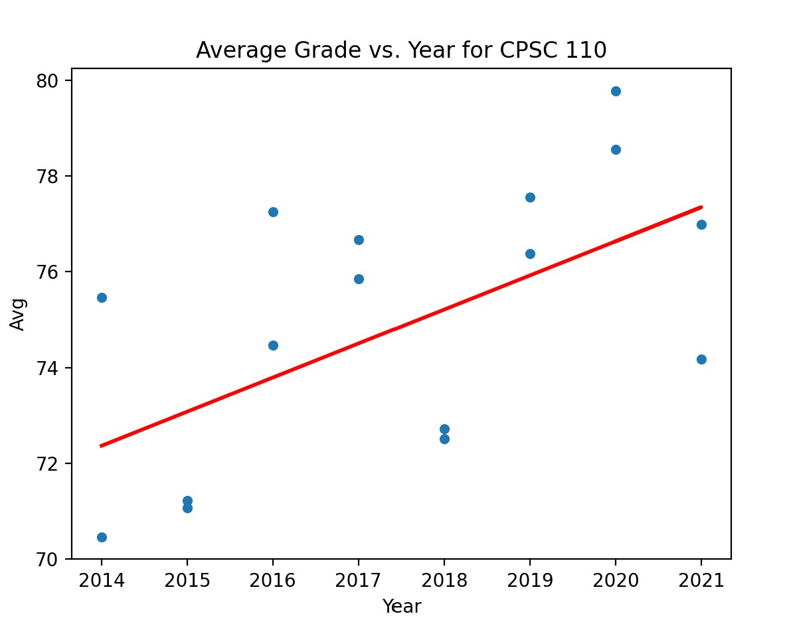

# UBC Grade Predictions

Data used for program can be found at https://github.com/DonneyF/ubc-pair-grade-data.

### Intro

---

The main emphasis of this project is to provide the user knowledge of past averages of certain courses and also show predictions for given years. Program that uses a linear regression machine learning model to predict your grade in a course relative to the year. The model is trained on the data from the past 5 years and then tested on the data from the current year. The model is then used to predict the grade of the current year.

**MODEL HAS +/- 5% MARGIN OF ERROR.**

#### Here's an example of the output for the course CPSC 110:

### How to use

---

Program will ask for CAMPUS _(UBCV/UBCO)_ and COURSE CODE _(CPSC 110/CPEN 221/...)_. User will have to enter year for prediction, then the program will output the predicted grade for the course, as well as a graph representation of the data.
